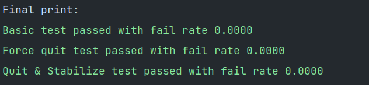

# Report

本项目实现了一个基于`chord`协议的分布式哈希表，以及一个简单的即时通讯软件`NCPIMS`。


## Chord

### 文件结构

```c++
chord/
	ChordNode.go   // type ChordNode
	NodeWrapper.go // type NodeWrapper
	utils.go       // 一些常数、功能函数的定义
main/
	userdef.go     // 创建一个新node
	mytest.go      // 一个简单的命令行测试程序
	...            // 其他助教下发测试文件
```

### ChordNode

节点类，存储了所有节点相关的信息。

```go
type ChordNode struct {
    // 节点相关
	addr          string
	predecessor   string
	preLock       sync.RWMutex
	successorList [SuccessorListLen]string
	sucLock       sync.RWMutex
	fingerTable   [M]string
	fingerLock    sync.RWMutex
	next          int
	
    // 数据相关
	store         map[string]string
	storeLock     sync.RWMutex
	preBackup     map[string]string
	preBackupLock sync.RWMutex
	
    // 服务器相关
	online     bool
	onlineLock sync.RWMutex
	server     *rpc.Server
	listener   net.Listener
	quitSignal chan bool
}
```

由于在`rpc.Register`时注册的是`ChordNode`类，因此所有不符合`rpc`注册规范的函数（方法只能有两个可序列化的参数，其中第二个参数是指针类型，并且返回一个error类型，同时必须是公开的方法）均是**非导出的**（包括`interface`要求实现的接口）。

### NodeWrapper

```go
type NodeWrapper struct {
	node *ChordNode
}
```

由于`ChordNode`类无法实现接口要求的函数（这些函数要求是导出的，但不符合`rpc`注册规范），因此使用这个`wrapper`来实现接口。


## NCPIMS

### 文件结构

```c++
chord/
	ChordNode.go   // 与chord中相同
    NodeWrapper.go // 封装了chatroom需要实现的存储格式
    utils.go       // 增加了hash功能与string和[]byte的相互转化
main/
    chatroom.go    // 应用核心
    main.go        // chatroom command line的包裹函数
    userdef.go     // 不再使用dhtNode接口，以调用更多在NodeWrapper内实现的功能
    utils.go       // 一些常数与RSA加密相关功能函数的定义
    NaiveColor.go  // 实现了一个简单的颜色控制台输出功能
```


`NCPIMS`的实现参考了以下网站的代码：

https://studygolang.com/articles/22530

https://medium.com/@kevinbai/golang-%E4%B8%AD-string-%E4%B8%8E-byte-%E4%BA%92%E8%BD%AC%E4%BC%98%E5%8C%96-6651feb4e1f2


最终评测结果：


